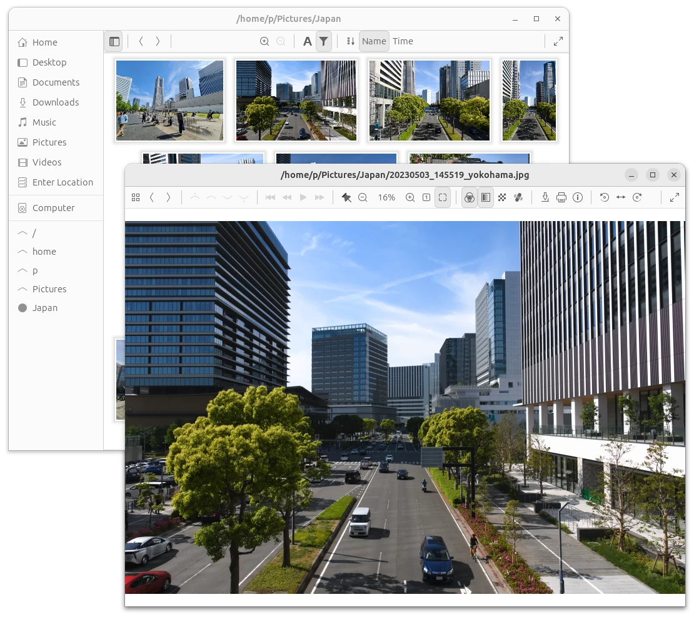

fiv
===

'fiv' is a slightly unconventional, general-purpose image browser and viewer
for Linux (that said, macOS and Windows ports are possible).

Features
--------
 - Uses a compact thumbnail view, helping you browse collections comfortably.
 - Supports BMP, (A)PNG, GIF, TGA, JPEG, WebP directly, plus optionally raw
   photos, HEIC, AVIF, SVG, X11 cursors and TIFF, or whatever your gdk-pixbuf
   modules manage to load.
 - Employs high-performance file format libraries: Wuffs and libjpeg-turbo.
 - Makes use of 30-bit X.org visuals, whenever it's possible and appropriate.
 - Has a notion of pages, and tries to load all included content within files.
 - Can keep the zoom and position when browsing, to help with comparing
   zoomed-in images.

Explicit non-goals
------------------
 - Editing--that's what _editors_ are for, be it GIMP or Rawtherapee;
   nothing beyond the most basic of adjustments is desired.
 - Following the latest GNOME HIG to the letter--header bars are deliberately
   avoided, for their general user hostility.
 - Memory efficiency is secondary to both performance and development effort.

Aspirations
-----------
Show colours as accurately as hardware allows.  Open everything.  Be fast.
Not necessarily in this order.

Packages
--------
Regular releases are sporadic.  git master should be stable enough.  You can get
a package with the latest development version from Archlinux's AUR.

Building and Running
--------------------
Build-only dependencies: Meson, pkg-config, asciidoctor or asciidoc +
Runtime dependencies: gtk+-3.0, glib>=2.64, pixman-1, shared-mime-info,
libturbojpeg, libwebp +
Optional dependencies: lcms2, LibRaw, librsvg-2.0, xcursor, libheif, libtiff,
ExifTool, resvg (unstable API, needs to be requested explicitly)

 $ git clone --recursive https://git.janouch.name/p/fiv.git
 $ meson builddir
 $ cd builddir
 $ meson compile

Considering the vast amount of dynamically-linked dependencies, do not attempt
direct installations via `ninja install`.  To test the program:

 $ meson devenv fiv

The lossless JPEG cropper is intended to be invoked from a context menu.

Windows
~~~~~~~
'fiv' can be cross-compiled for Windows, provided that you install a bunch of
dependencies listed at the beginning of 'msys2-cross-configure.sh',
plus rsvg-convert from librsvg2, and icotool from icoutils.
Beware that the build will take up about a gigabyte of disk space.

 $ sh -e msys2-cross-configure.sh builddir
 $ meson install -C builddir

If everything succeeds, you will find a portable build of the application
in the 'builddir/package' subdirectory.  Keep your expectations low.

Documentation
-------------
For information concerning usage, refer to link:docs/fiv.html[the user guide],
which can be invoked from within the program by pressing F1.

Contributing and Support
------------------------
Use https://git.janouch.name/p/fiv to report any bugs, request features,
or submit pull requests.  `git send-email` is tolerated.  If you want to discuss
the project, feel free to join me at ircs://irc.janouch.name, channel #dev.

Bitcoin donations are accepted at: 12r5uEWEgcHC46xd64tt3hHt9EUvYYDHe9

License
-------
This software is released under the terms of the 0BSD license, the text of which
is included within the package along with the list of authors.
