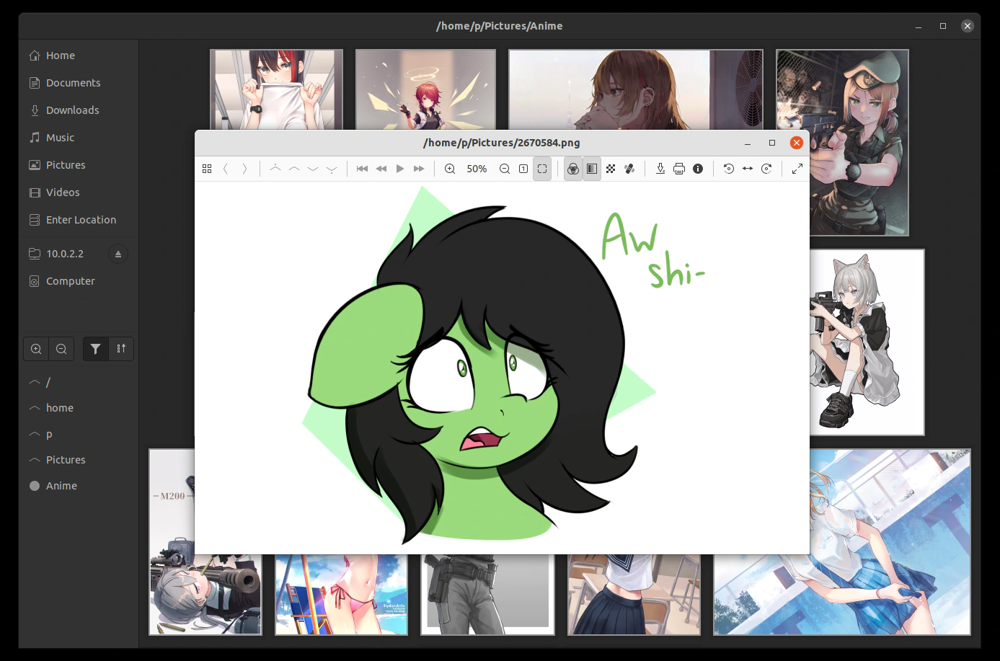

fiv
===

'fiv' is a slightly unconventional, general-purpose image browser and viewer.

Features
--------
 - Uses a compact thumbnail view, helping you browse collections comfortably.
 - Supports BMP, (A)PNG, GIF, TGA, JPEG, WebP directly, plus optionally raw
   photos, HEIC, AVIF, SVG, X11 cursors and TIFF, or whatever your gdk-pixbuf
   modules manage to load.
 - Employs high-performance file format libraries: Wuffs and libjpeg-turbo.
 - Makes use of 30-bit X.org visuals, whenever it's possible and appropriate.
 - Has a notion of pages, and tries to load all included content within files.

Explicit non-goals
------------------
 - Editing--that's what _editors_ are for, be it GIMP or Rawtherapee;
   nothing beyond the most basic of adjustments is desired.
 - Following the latest GNOME HIG to the letter--header bars are deliberately
   avoided, for their general user hostility.
 - Portability to non-UNIXy systems, although patches are welcome.
 - Memory efficiency is secondary to both performance and development time.

Aspirations
-----------
Show colours as accurately as hardware allows.  Open everything.  Be fast.
Not necessarily in this order.

Packages
--------
Regular releases are sporadic.  git master should be stable enough.  You can get
a package with the latest development version from Archlinux's AUR.

Building and Running
--------------------
Build dependencies: Meson, pkg-config +
Runtime dependencies: gtk+-3.0, glib>=2.64, pixman-1, shared-mime-info,
libturbojpeg, libwebp, spng>=0.7.0 +
Optional dependencies: lcms2, LibRaw, librsvg-2.0, xcursor, libheif, libtiff,
gdk-pixbuf-2.0, ExifTool

 $ git clone --recursive https://git.janouch.name/p/fiv.git
 $ meson builddir
 $ cd builddir
 $ meson compile

Considering the vast amount of dynamically-linked dependencies, do not attempt
direct installations.  To test the program, help it find its custom thumbnailer:

 $ PATH=$(pwd):$PATH ./fiv

Pressing F1 will give you a convenient list of keyboard shortcuts.

Configuration
-------------
The standard means to adjust the looks of the program is through GTK+ 3 CSS.
As an example, to tightly pack browser items, put the following in your
_~/.config/gtk-3.0/gtk.css_:

 fiv-browser { -FivBrowser-spacing: 0; padding: 0; border: 0; margin: 0; }

Similarly, you can adjust some of the key bindings, as per the command table
in link:fiv-view.h[]:

 @binding-set ViewBindings { bind 'p' { 'command' (print) }; }
 fiv-view { -gtk-key-bindings: ViewBindings; }

Should you want to experiment, you will find the GTK+ inspector very helpful.

Contributing and Support
------------------------
Use https://git.janouch.name/p/fiv to report any bugs, request features,
or submit pull requests.  `git send-email` is tolerated.  If you want to discuss
the project, feel free to join me at ircs://irc.janouch.name, channel #dev.

Bitcoin donations are accepted at: 12r5uEWEgcHC46xd64tt3hHt9EUvYYDHe9

License
-------
This software is released under the terms of the 0BSD license, the text of which
is included within the package along with the list of authors.
